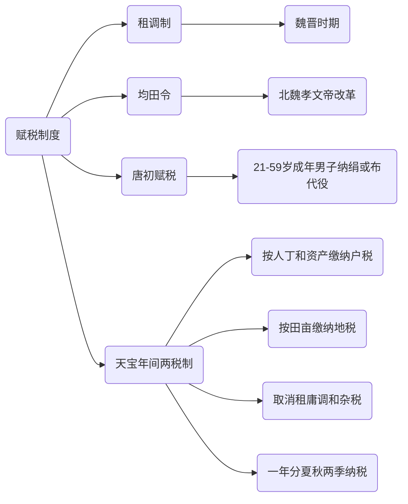

# 文献笔记

文献笔记在 slip box 中是在阅读了特定的文献之后使用自己的简短的语言去重新转述成笔记的一个过程，但在该知识库中对这个概念重新定义

## 模板

::: tip

# 第七课 隋唐制度变化与创新

## 1. 九品中正制与科举制

### 1.1 九品中正制

- **定义**：九品中正制是唐朝由曹魏所创立的选官制度，长期存在。它通过考量官员的家事、道德和才能，进行人才选拔。
- **简要解释**：九品中正制通过综合考察官员的家世背景、品德和能力，用九个品级来评定官员的地位和职位，高品级的官员地位较高，低品级地位较低。

**帮助理解**：这种制度在早期起到选拔人才的作用，但随着时间推移，由于过于看重家世，导致九品中正制渐渐沦为士族特权的工具。士族占据优势，人才选拔的公平性逐渐丧失。

### 1.2 科举制

- **定义**：隋朝后废除九品中正制，采取类似现代考试制度进行官员选拔。
- **发展历程**：隋炀帝时期形成科举制，唐朝继承并不断更新。
- **唐代更新**：唐太宗增加新科目，武则天扩大科举取士人数，首创武举和殿试。唐玄宗任用高官主持考试（监考员）。

**帮助理解**：科举制度是一种通过考试选拔官员的制度，相比九品中正制，它更加公平和开放。后来唐朝不断对科举制度进行改进，增加新科目和考试形式，提高了选拔官员的效率和准确性。

## 2. 三省六部制

- **定义**：隋文帝确立三省六部制，包括中书省、门下省和尚书省，以及六个部门：吏、户、礼、兵、刑、工。
- **作用**：三省充当了宰相的职位，提高了任用宰相的范围。政事堂设立提高了工作效率，体现了三省一体化趋势。
- **问题**：宰相权力过大导致腐败，部门间可能产生矛盾和冲突，唯分数论现象出现。

**帮助理解**：三省六部制是一种相对高效的政治制度，通过设立三省和六部门来分工管理国家事务。然而，宰相权力过大也带来了腐败问题，不同部门之间的矛盾可能影响政府的稳定运作。

## 3. 赋税制度

- **魏晋时期**：实行租调制，按户征收粮食和绢帛。
- **北魏孝文帝改革**：颁布均田令，规定一夫一妻每年纳粟为租，纳帛或布为调。
- **唐初赋税**：对象定位为21-59岁成年男子，除租调外，不征役的男子可纳绢或布代役（庸）。
- **天宝年间两税制**：每户按人丁和资产缴纳户税，按田亩缴纳地税，取消租庸调和杂税，一年分夏秋两季纳税。

:::

以上的模板并不是一成不变的，不同的科目会衍生出不同的模板

但是核心的思路包括以下几点：

- 正确的标题分级 -> 便于查找定位知识点
- 对记录下来的知识点要有明确的标识 -> 例如这一段话是什么东西，有什么用
- 通过一些图表辅助记录 
- 需要有更改记录

## 更改记录

若对文献笔记有任何的改动需要在文件开头添加一个表格记录每一次的改动

并且需要保留旧文件于 github 上并且在 Wiki 对应的位置贴上一个链接

表格示例：

| 版本   | 改动说明 | 改动时间 |
| ------ | -------- | -------- |
| v1.0.0 | 创建     | 7/29     |
| v1.0.1 | 补充     | 8/21     |
|        |          |          |

## 编号

文献笔记的代号是 -> LN ；取 Literature notes 的首字母进行命名

他的编号规则是：

::: tip 如何编号

FN[num]...

正确的编号：FN1；FN2；FN1a；FN1a1

错误的编号：FNa1；FN1a1a1a1

:::

## 其他说明

在早期的笔记编排时可以使用 chatgpt 等工具进行辅助，但是一旦排版成熟之后需要脱离 chatgpt 等工具

